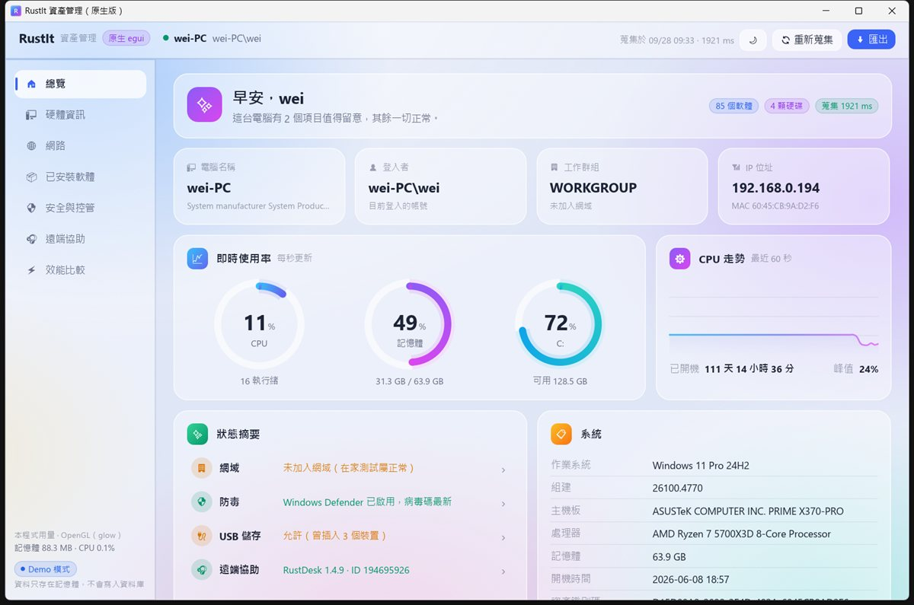
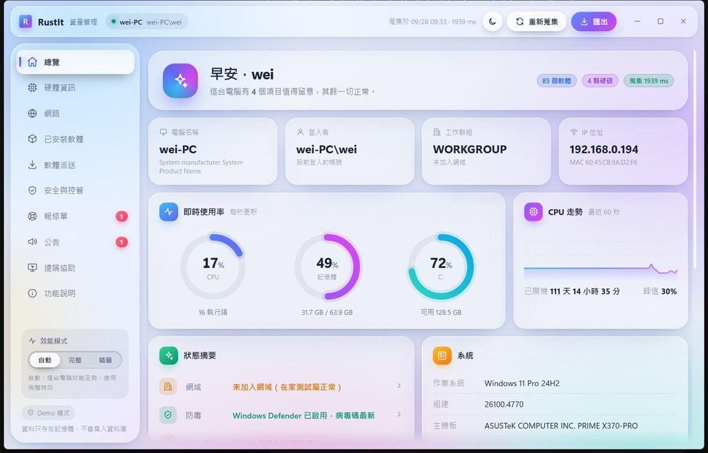
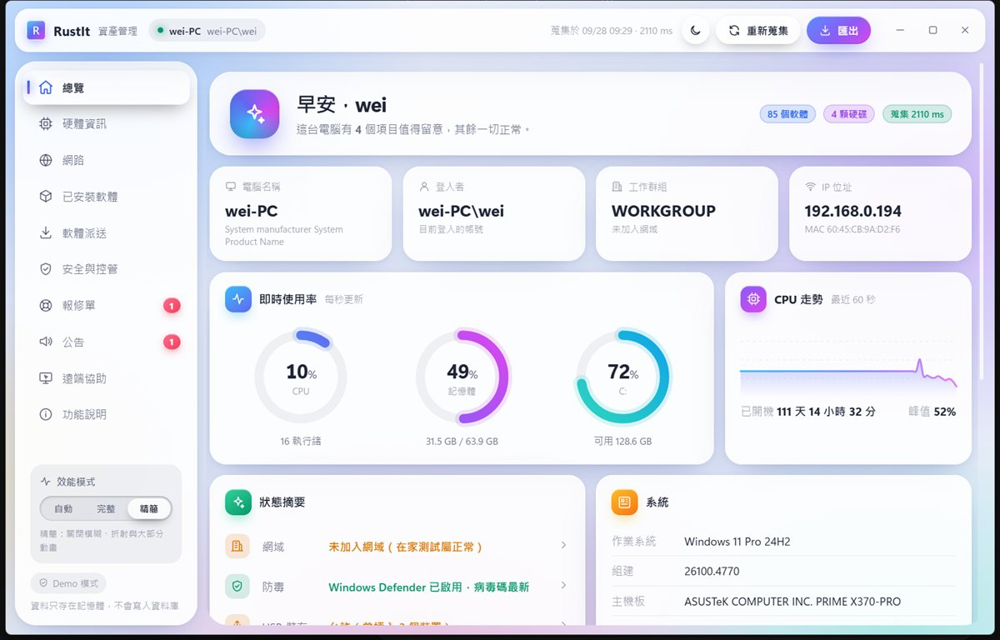

# 介面技術比較：原生（egui）與 WebView2（Tauri）

> 量測日期：2026-09-28
> 目的：為 [PRD](PRD.md) 第 3 節「托盤程式：`tray-icon` + `egui`（或 Tauri）」的技術選擇提供實測數據。

## 摘要

- **記憶體**：同樣的畫面、同樣的資料蒐集程式，原生版約是 WebView2 版的 **1/5**（工作集 89 MB 對 481 MB）。
- **行程與執行緒**：原生版只有 **1 個行程、14 條執行緒**；WebView2 版是 **7 個行程、245 條執行緒**。
- **CPU**：兩者閒置時都很低（全部核心合計 0.10% 對 0.18%）。扣掉兩版共同的系統使用率讀取後，介面本身約 **3–7 ms 對 16 ms**（每秒用掉的 CPU 時間）。
- **特效不是主因**：WebView2 版切到「精簡」模式（關掉模糊、折射、動畫）後，私有記憶體只從 470 MB 降到 377 MB，差距主要來自瀏覽器引擎本身。
- **原生版的代價**：介面要用 Rust 撰寫，視覺效果和現成元件較少，而且需要支援 OpenGL 2.0 的顯示卡驅動。WebView2 版開發快，可以直接用前端技術和人才。

## 比較對象

| | 原生版 | WebView2 版 |
| --- | --- | --- |
| 執行檔 | `dist/RustIt-Native.exe`（`crates/native`） | `dist/RustIt-Demo.exe`（`crates/demo`） |
| 介面技術 | egui 0.36，Rust 直接產生圖形，OpenGL 繪製 | HTML / CSS / JavaScript，由 Windows 內建的 WebView2 顯示 |
| 資料蒐集 | `rustit-collector`（WMI、登錄檔、sysinfo） | 同左 |
| 頁面 | 總覽、硬體、網路、軟體、安全、遠端協助、效能比較 | 總覽、硬體、網路、軟體、安全、遠端協助、報修單、公告、軟體派送、功能說明 |
| 視覺效果 | 半透明卡片、靜態背景光暈、漸層 | 背景模糊、玻璃折射、動畫（可切換「精簡」模式） |

兩個版本的配色和版面相同。原生版沒有報修單、公告、軟體派送這幾頁：它們是前端的模擬流程，和效能比較無關。

| 原生版 | WebView2 版（自動 → 完整特效） | WebView2 版（精簡） |
| --- | --- | --- |
|  |  |  |

## 量測方法

- **電腦**：AMD Ryzen 7 5700X3D（8 核 16 執行緒）、64 GB RAM、NVIDIA RTX 4070 Ti（驅動 32.0.16.1047）、Windows 11 Pro 24H2（26100.4770）、顯示縮放 125%、WebView2 Runtime 153.0.4234.48。
- **畫面**：兩個版本都停在啟動後的「總覽」頁。這頁每秒更新一次 CPU 與記憶體使用率，和實際使用時的負載相同。
- **程序**：用 `scripts/bench.ps1` 依序啟動兩個 exe，等 8 秒讓資料蒐集完成，再取樣 30 秒。每個版本量 3 次取平均，數字是主程式加上所有子行程的合計。
- **公告彈窗**：WebView2 版啟動後會跳出「重要公告」彈窗，背後整個畫面會被模糊。腳本會先按「我已閱讀」關掉它，讓兩個版本停在同一個畫面。
- **CPU**：以 CPU 週期（`QueryProcessCycleTime`）計算，換算成「每經過 1 秒用掉幾毫秒 CPU」。
- **有效性**：量測期間視窗必須在前景，因為兩個版本在背景時都會暫停更新。腳本每次都會檢查，這次 9 次量測全部有效。

## 結果

| 項目 | 原生 egui | WebView2 完整特效 | WebView2 精簡 | WebView2 完整 ÷ 原生 |
| --- | ---: | ---: | ---: | ---: |
| 行程數 | 1 | 7 | 7 | 7× |
| 執行緒 | 14 | 245 | 244 | 17.5× |
| 控制代碼 | 447 | 3,598 | 3,585 | 8.0× |
| 工作集 平均（MB） | 88.7 | 480.8 | 455.6 | 5.4× |
| 工作集 最高（MB） | 89.9 | 484.1 | 458.7 | 5.4× |
| 私有記憶體 平均（MB） | 100.6 | 469.7 | 376.8 | 4.7× |
| 私有記憶體 最高（MB） | 101.8 | 586.1 | 431.2 | 5.8× |
| CPU 時間（毫秒 / 每秒） | 15.6 | 28.2 | 27.2 | 1.8× |
| CPU（全部核心 = 100%） | 0.10% | 0.18% | 0.17% | 1.8× |
| 執行檔（MB） | 6.7 | 9.7 | 9.7 | 1.5× |

- **工作集**：實際佔用的實體記憶體，工作管理員「詳細資料」頁的「工作集」欄。
- **私有記憶體**：只屬於這個程式、不能和其他程式共用的部分。
- MB 為 1024 × 1024 位元組。

## 怎麼解讀

### 記憶體

WebView2 版的 481 MB 分散在 7 個行程：

| 行程 | 工作集（MB） |
| --- | ---: |
| msedgewebview2（GPU） | 151 |
| msedgewebview2（瀏覽器主行程） | 127 |
| msedgewebview2（網頁轉譯） | 117 |
| msedgewebview2（網路服務） | 37 |
| msedgewebview2（儲存服務） | 18 |
| msedgewebview2（當機回報） | 9 |
| RustIt-Demo（Rust 主程式） | 約 20 |

原生版的 89 MB 中，相當大一部分是顯示卡的 OpenGL 驅動。同一個程式改用 wgpu（DirectX 12）繪圖，工作集會變成 271 MB。所以在不同顯示卡上，原生版的數字會有差異。

「精簡」模式只省下約 20% 的私有記憶體，因為瀏覽器引擎的各個行程不論有沒有特效都會存在。

### CPU

兩個版本都遠低於 1%，但可以拆開來看：

- **每秒讀取系統使用率**：兩個版本都用 `sysinfo` 讀取 CPU / 記憶體使用率，這一項本身就約 12 ms/秒。這是在原生版不重繪的頁面量到的，兩版後端做的是同一件事。
- **介面繪製**：扣掉上面那項後，原生版約 3–7 ms/秒（隨每次量測浮動），WebView2 版約 16 ms/秒（估計值）。

### 啟動時間

- **原生版**：從行程建立到畫出第一個畫面約 0.3–0.4 秒，程式內「效能比較」頁可以看到。
- **WebView2 版**：網頁載入完成的時間這次沒有量到。WebView2 會先顯示空白視窗，再載入網頁，外部無法準確判斷畫面何時完成。

### 部署與相容性

兩者都是單一 exe，不需要安裝。

- **原生版**：需要支援 OpenGL 2.0 的顯示卡驅動。沒有安裝驅動的電腦（例如部分虛擬機）會開不起來，程式會跳出說明，請使用者改用 WebView2 版。
- **WebView2 版**：需要 WebView2 Runtime，Windows 11 內建，Windows 10 多半已隨 Edge 更新安裝。沒有顯示卡驅動時會自動改用軟體繪圖。

## 取捨

| 面向 | 原生（egui） | WebView2（Tauri） |
| --- | --- | --- |
| 資源用量 | 記憶體約 1/5，1 個行程 | 記憶體約 5 倍，7 個行程 |
| 介面開發 | 用 Rust 寫，改介面要重新編譯 | HTML / CSS / JS，可以用瀏覽器即時預覽，前端人才多 |
| 視覺效果 | 基本圖形與漸層，沒有背景模糊 | CSS 做得到的都可以 |
| 現成元件 | 較少，這次的圓環、走勢圖、表格都是自己畫的 | 網頁元件、圖表函式庫齊全 |
| 與 IT 後台共用 | 無法共用 | 後台是 React，可共用設計與部分元件 |
| 相容性 | 需要 OpenGL 2.0 顯示卡驅動 | 需要 WebView2 Runtime，沒有顯示卡驅動也能跑 |
| 中文輸入、螢幕報讀 | egui 支援輸入法，但這次沒有實測；螢幕報讀功能這次沒有開啟 | 瀏覽器原生支援 |
| 程式碼量（參考） | 約 2,300 行 Rust | 約 3,000 行 HTML / CSS / JS（頁面較多），加上約 700 行 Rust 後端 |

## 建議（供討論）

托盤程式會常駐在每一台電腦上，但它的畫面（報修、公告、自助資訊）只是偶爾打開。所以真正關鍵的是「常駐、視窗關閉時」的用量：

1. **原生（egui）**：資源用量明確較低。如果托盤程式需要一直保留視窗，每台電腦約可省下 380 MB 記憶體。代價是介面開發比較慢，視覺效果也比較樸素。
2. **Tauri**：適合重視介面開發速度與一致性（和 React 後台共用設計）的情況。建議在視窗關閉時一併釋放 WebView，只在打開時才載入。代價是每次開啟要等 WebView 啟動。
3. **下一步**：建議做一個簡單的托盤原型，量測兩種做法在「常駐、視窗關閉」與「打開視窗所需時間」上的差異，再決定。這次的比較都是在視窗開著的情況下量的。

## 如何重現

```bash
cargo build --release -p rustit-native -p rustit-demo
```

```bash
powershell -ExecutionPolicy Bypass -File scripts/bench.ps1 -Runs 3 -Seconds 30
```

- 量測期間不要切換視窗，也不要操作滑鼠和鍵盤。
- 要量 WebView2 版的精簡模式，先在 WebView2 版左下角把「效能模式」切到「精簡」，關掉程式後再執行腳本（設定會保存）。

## 附註

- **CPU 計時方式**：早期版本的腳本用 `TotalProcessorTime` 計算 CPU。它以 15.6 ms 的時脈中斷取樣，對每秒只醒來一次的輕量程式，誤差比數值本身還大。改用 CPU 週期後數字才穩定。
- **Tauri 視窗辨識**：Tauri 啟動初期會有一個 14×14 的隱藏事件視窗被系統當成主視窗，早期腳本因此在部分次數沒有把正確的視窗帶到前景。
- 以上兩個問題都已經在 `scripts/bench.ps1` 修正。README 之前列出的數字以本文件為準。
- **沒有納入比較的項目**：
  - 顯示卡記憶體（VRAM）。
  - 「常駐但視窗關閉」時的用量。
  - 低階電腦上的表現。
