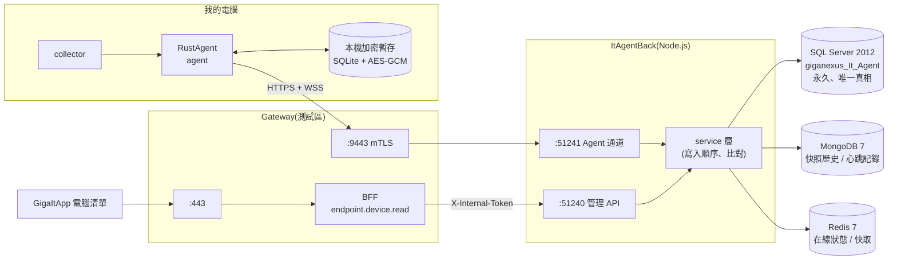

# 整合計畫:RustAgent → ItAgentBack(Node.js)→ GigaItApp 電腦清單

> **狀態**:計畫 v0.4(2026-10-07)。**M0–M4 完成,基本階段的 1、3 已在測試區達成**(我的電腦經 `:9443` 回報、測試區 GigaItApp 電腦清單看得到);2 的「本機加密暫存與補傳」屬 M5,需求方決定延後。進度與每個 commit 見 `DevelopmentProcess/NewFeatures.md`。
> **時程以 NexusPlan 甘特圖為準**:基本階段 M0–M5 已登記為 W6-7 ~ W6-12(2026-10-06 ~ 10-07,需求方要求兩天內完成基礎功能);W6 原有的高階工作(W6-1 ~ W6-M)維持原排程,**進階功能待員工入口網與 GigaItApp 功能完善後再做**。本文只列順序與完成條件,不列日期。
> **上位規範**:`../../giga-api-gateway-bff/docs/ENDPOINT-AGENT-GUIDE.md`(通道、權限、API 草案)、`BACKEND-GUIDE.md`(port、內部 Token、OpenAPI 註冊)、`DATABASE.md` §0(SQL Server 2012 限制)。
> **相關決策**:[0004 Endpoint Server 改用 Node.js(`ItAgentBack`)](decisions/0004-node-endpoint-server.md)。

---

## 1. 目標與範圍

**終極目標**:做出對標 IP-guard、SmartIT 的端點管理產品主要功能(資產、控管、軟體派送、遠端協助、報修與公告、報表;見 `PRD.md`)。本計畫只做**基本階段**,並把後續功能需要的地基(契約版本、指令通道、資料表擴充點)先留好。

**基本階段只有三件事**:

| # | 項目 | 完成標準 |
| --- | --- | --- |
| 1 | **前後端能通** | 我的電腦上的 RustAgent 經 Gateway `:9443` 連到 ItAgentBack:HTTPS 回報成功、WebSocket 心跳不中斷;關掉 Agent 約 90 秒內變離線 |
| 2 | **資料庫寫入** | 回報寫入 SQL Server `giganexus_It_Agent`(永久)、Mongo(快照歷史)、Redis(在線狀態);重啟後端資料仍在;資料庫連不上時 Agent 不遺失資料(本機加密暫存),恢復後補傳並比對 |
| 3 | **ItApp 能看到資訊** | GigaItApp「電腦清單」顯示我的電腦:名稱、在線 / 離線、使用者、IP、作業系統、CPU、記憶體、最後回報;點開看詳情(硬體、網卡、磁碟、防毒) |

另兩項始終成立:沒有 `endpoint.device.read` 的帳號看到「Gateway 權限不足」(**目前截圖的 403 是預期行為**,授權後才有資料);資料權限由 BFF 把關,ItAgentBack 不信任瀏覽器送來的任何身分標頭。

**不在基本階段**:下指令(`/basic-commands`、`/admin-commands`)、軟體派送、遠端畫面、USB / 網路控管、報修與公告、Watchdog、托盤、Windows 服務安裝(MSI)、Windows 憑證存放區、CRL 更新、200 台壓測。見 §7 路線圖。

### 現況(2026-10-07)

| 項目 | 狀態 |
| --- | --- |
| `collector`(蒐集 `ComputerInfo`) | ✅ 已完成 |
| `RustAgent/crates/agent`(`rustit-agent`) | ✅ 前景執行;HTTPS 回報、WebSocket hello / 心跳、退避重連、PEM 憑證 |
| `ItAgentBack`(endpoint-server) | ✅ 測試區(主機 2,容器 `endpoint-server` + `ita-mongo` / `ita-redis`,CI `develop` 部署) |
| Gateway `:9443`(`agent.conf`) | ✅ HTTPS / WebSocket(Gateway d9890dd、5f5b989);主機 2 防火牆暫時只開放 10.10.112.13 |
| BFF 路由 `/api/endpoint/*` | ✅ 自動註冊、IT 已發佈(2026-10-07);`endpoint.device.read` 由 GigaItApp `gateway-rbac.yaml` 綁到電腦清單 |
| GigaItApp 電腦清單頁 | ✅ 名稱 / 狀態 / 使用者 / IP / 作業系統 / CPU / 記憶體 / 最後回報,點列看詳情 |
| Agent 本機加密暫存、`/sync` | ⏸ M5,延後 |

---

## 2. 目錄結構(已決定:拆成兩個子專案)

`RustIt/` 維持**同一個 git repo、同一個資料夾名稱**(Gateway §10.2、`x-gateway.project: RustIt` 都用這個名字),底下分成兩個子專案:

```
RustIt/
├─ AGENT.md                  兩個子專案共用的 AI 準則(總入口)
├─ README.md
├─ docs/                     跨子專案文件:PRD、PROJECT-MAP、本計畫、decisions/、contracts/(資料契約)、DevelopmentProcess/
├─ RustAgent/                Rust:端點電腦上的程式
│  ├─ Cargo.toml / Cargo.lock
│  ├─ crates/ collector、agent(新增)、native、demo;之後 watchdog、tray
│  ├─ scripts/  dist/  docs/(ui-performance-comparison、images)
└─ ItAgentBack/              Node.js(Fastify + TypeScript):Endpoint Server
   ├─ src/ test/ db/migrations/ deploy/ docs/
   └─ package.json            gateway.project = RustIt
```

- **搬移範圍**:Rust 專屬的檔案進 `RustAgent/`(`Cargo.toml`、`Cargo.lock`、`crates/`、`scripts/`、`dist/`、`ui-performance-comparison.md`、`images/`)。**PRD、PROJECT-MAP、decisions 留在 `RustIt/docs/`**:兩個子專案共用,且 Gateway 與其他專案已用 `../RustIt/docs/...` 路徑參照,搬走會斷連結。若你要連 `docs/` 一起搬進 `RustAgent/`,請告訴我,我會連同跨 repo 的連結一起列出。
- 搬移用 `git mv` 保留歷史,**一次獨立 commit**(只搬檔案、不改內容),再補必要的路徑修正(`.gitignore`、`bench.ps1`、`README`)。
- **外層需同步更新**(根目錄 repo,取得同意後):`../PROJECT-MAP.md`、`../AGENT.md` §3 導航表、`../GigaNexusAIPlan/architecture/workspace.json`(`RustIt` 拆出 `RustAgent` / `ItAgentBack`,`endpoint-server` 的說明與 `docs` 路徑)。Gateway 的 `AGENT.md` §10.2 與 `ENDPOINT-AGENT-GUIDE.md` 同步見 ADR 0004。

---

## 3. 架構與資料庫



### 3.1 三種儲存的分工

**原則:SQL Server 是唯一真相;Mongo 與 Redis 可以清空重建,不放只存在那裡的資料。**

| 儲存 | 放什麼 | 為什麼 | 掛了怎麼辦 |
| --- | --- | --- | --- |
| **SQL Server `giganexus_It_Agent`**(schema `ita`) | `device`(登錄、DN、指紋、停用、首次 / 最後回報)、`device_inventory`(最新一份的摘要欄位 + 完整 payload `NVARCHAR(MAX)`)、`device_nic`(可依 IP / MAC 查)、`device_event`(稽核:新指紋、停用、重複 DN) | 永久、可報表、公司既有的資料庫與備份機制 | **回 503**,Agent 留在本機暫存重試(§4);這是唯一會擋住回報的儲存 |
| **MongoDB 7** | 每次回報的完整快照(依 `deviceId` + `collectedAt`,保留最近 N 份或 N 天)、心跳記錄(短 TTL) | 結構彈性的大 JSON(軟體清單數百筆)寫入快、用來比較前後差異;不佔用 SQL Server | 記 warn、略過,不影響回報成功;恢復後不補(歷史是加分項) |
| **Redis 7** | 在線狀態(`ita:{env}:online:{deviceId}`,TTL 90 秒由心跳續期)、清單快取(短 TTL)、同一份 inventory 的 hash 去重 | 心跳每 30 秒 × 台數,不該每次都寫 SQL Server;離線判斷用 TTL 過期 | 在線狀態退回以 SQL `last_seen_at` 判斷;快取直接穿透 |

- **寫入順序**(`POST /agent/v1/inventory`):驗證契約 → 與 Redis / SQL 的 `content_hash` 比對,**沒變只更新 `last_seen_at`** → 變了就在**一個交易**寫 SQL(`device`、`device_inventory`、`device_nic`)→ 成功後寫 Mongo 快照 → 更新 Redis → 回 `200`。SQL 失敗不寫其他兩者。
- 在線狀態**只由心跳 / WebSocket 決定**,不由 inventory 決定;SQL 的 `last_seen_at` 以較低頻率(例如每 5 分鐘)落盤,避免每次心跳都寫庫。
- Redis key 一律帶前綴 `ita:{env}:`;Mongo 與 Redis **不宣告對外 port**,只在 ItAgentBack 的內部網路(同 `giga-observe`:`../giga-observe/docker-compose.yml`、AGENT §9.1)。測試區與正式區**各一套、不共用**,資料目錄 `data/${ENV}/...`。

### 3.2 SQL Server 注意事項(`DATABASE.md` §0)

| 項目 | 規則 |
| --- | --- |
| 版本 | 2012 RTM:**無** `JSON_VALUE` / `OPENJSON`、`STRING_AGG`、`TRIM`、`CREATE OR ALTER`、`DROP … IF EXISTS`;JSON 一律由 ItAgentBack 組 / 解,資料庫只當字串存 |
| 連線 | 2012 RTM 不支援 TLS 1.2 → `encrypt: false`。**Gateway 的決定(2026-09-24)只涵蓋 `giganexus_gw` 與 LOS**;本庫在同一台主機(10.10.130.220)但回報內容含使用者名稱、序號等,**主管已同意本庫同樣內網不加密**(2026-10-06,D8) |
| 存取 | `mssql` 驅動(與 BFF 一致);migration 用**手寫 SQL 檔**(`ItAgentBack/db/migrations/`,2012 相容本來就要人工審查),不使用 ORM(D3 已確認) |
| 共通欄位、主鍵 | 沿用 Gateway DATABASE.md 的慣例(`created_at/by`、`updated_at/by`、`row_ver`、主鍵 `INT IDENTITY`、對外識別用 `device_id` UUID) |
| 環境 | 比照 `giganexus_gw`:**開發與測試共用 `giganexus_It_Agent_test`**(帳號 `ita_app` / `ita_migrate`);**正式 `giganexus_It_Agent`**(帳號 `ita_prod_app` / `ita_prod_migrate`);整合測試專用 `giganexus_It_Agent_poc_test`(測試會清空 schema,不可指向前兩者)。你指定的名稱 `giganexus_It_Agent` 用於正式庫(D2 已確認) |

> **資料庫由你建立**(AI 不以 `sa` 建庫)。D2 已確認,M1 開工時我會給你**完整的 T-SQL**(CREATE DATABASE `giganexus_It_Agent_test` 與 `_poc_test`、登入帳號與權限、schema `ita`),你在 SQL Server(10.10.130.220)上執行後,把帳密放進本機 `.env` 與測試區機密(不進版控)。正式庫 `giganexus_It_Agent` 隨正式區部署(預計 2026-12)再建。

---

## 4. Agent 本機加密資料庫與連線後比對

**目的**:Agent 連不上後端(網路中斷、後端或 SQL Server 停機、Gateway 重啟)時不遺失蒐集結果;連回後與後端**比對**再寫入,不重複、不覆蓋較新的資料。

### 4.1 本機儲存(RustAgent)

| 項目 | 規則 |
| --- | --- |
| 位置 | `%ProgramData%\GigaNexus\Agent\store.db`(ACL 只允許 SYSTEM、Administrators,指南 §6.1);dev 用工作目錄 |
| 引擎 | SQLite(`rusqlite`,bundled)。**欄位內容以 AES-256-GCM 加密**(`aes-gcm`),金鑰由 Windows **DPAPI(電腦範圍)** 保護後存檔;dev 用金鑰檔。**不採 SQLCipher**:在 Windows 建置需編譯 OpenSSL(Perl / NASM),增加部署與 CI 負擔;應用層加密對本需求足夠(D4 已確認) |
| 內容 | `outbox`(尚未被後端確認的快照:`agent_seq`、`collected_at`、`content_hash`、加密 payload)、`state`(`device_id`、最後被確認的 `seq` / `hash`、後端回傳的設定) |
| 容量 | outbox 上限(例如 50 份或 20 MB),滿了丟最舊;相同 `content_hash` 連續出現只保留一份 |
| 日誌 | 不寫 payload、金鑰、Token |

### 4.2 比對規則(連線後)

1. 連上後 Agent 送 `POST /agent/v1/sync`:`{ last_acked_seq, last_acked_hash, pending: [{agent_seq, collected_at, content_hash}] }`。
2. ItAgentBack 以 `(device, agent_seq)` **冪等**判斷:已收過的丟棄;`content_hash` 與目前最新相同的標記「不需上傳 payload」;其餘列入 `need`。回覆 `{ device_id, need: [agent_seq…], server_state: { status, last_hash } }`。
3. Agent 只上傳 `need` 的快照,後端依 `collected_at` 排序寫入:**最新的一份成為目前資料**,較舊的只進 Mongo 歷史;時鐘不可信時以 `agent_seq`(單調遞增)輔助判斷,並記錄 `received_at`。
4. **權限與狀態以後端為準**(裝置是否被停用、`device_id`):Agent 套用後端回傳值;**資產事實以 Agent 為準**(最新的蒐集結果)。
5. 後端確認後,Agent 才從 outbox 刪除該筆。

> 離線暫存與比對屬「資料庫寫入」的完整性要求,**排在基本階段的最後一個里程碑**(M5):核心路徑(通、寫入、顯示)先完成並驗收,再加上離線能力;若你希望縮減範圍,可獨立延後而不影響 §1 的前兩項以外的驗收。

---

## 5. 資料契約與管理 API

`docs/contracts/` 放 JSON Schema 與去識別化範例檔,**是 RustAgent 與 ItAgentBack 的唯一共同依據**,兩邊各有一組吃同一份範例的測試。

| 端點 | 內容 |
| --- | --- |
| `POST /agent/v1/inventory` | 完整 `ComputerInfo`(collector 的 serde JSON,snake_case)+ `agent_version`、`agent_seq`、`collected_at`、`content_hash` |
| `POST /agent/v1/sync` | §4.2 |
| WS `GET /agent/v1/ws` | 信封 `{v, type, id, body}`:`hello`、`heartbeat`(30 秒)、`heartbeat_ack` |

- 裝置鍵 = `x-client-cert-dn` 完整字串(指南 §3.3);`deviceId`(UUID)由後端指派。
- 只新增欄位;收到不認得的欄位忽略、不認得的 `type` 回 `unsupported`;不相容變更走 `/agent/v2/`。

管理 API(經 BFF,`X-Internal-Token`、`aud=endpoint-api`):

| 方法 | 路徑 | `x-permission` | 回傳 |
| --- | --- | --- | --- |
| `GET` | `/api/endpoint/devices` | `endpoint.device.read` | `{ items: DeviceSummary[] }`(沿用 GigaItApp 現有格式) |
| `GET` | `/api/endpoint/devices/{deviceId}` | `endpoint.device.read` | `DeviceDetail`:摘要 + 完整快照 |

`DeviceSummary` 在 GigaItApp 現有 `EndpointDevice`(`deviceId, computerName, certDn, certFingerprint, online, firstSeenAt, lastSeenAt`)之上**只新增**:`userName, domain, osName, osVersion, manufacturer, model, cpuName, memoryTotal, ips[], agentVersion, lastInventoryAt`。清單不帶軟體清單,只在詳情。

---

## 6. 階段與工作項目

> 階段 A(M0–M3)不改 Gateway,可本機閉環驗證;階段 B(M4)起動其他 repo,**先取得同意**(§9)。

### M0 目錄重整與資料契約(本 repo)

- [x] 建立 `RustAgent/`、`ItAgentBack/`,以 `git mv` 搬移 Rust 檔案(§2),**單獨一個 commit**;修正 `.gitignore`、`scripts/bench.ps1`、README 路徑;`cargo build` / `cargo test -p rustit-collector` 搬移後仍通過。
- [x] 更新 `AGENT.md`、`docs/PROJECT-MAP.md`、`README.md` 路徑;外層根目錄 `PROJECT-MAP.md` 中指向 `RustIt/docs/ui-performance-comparison.md` 的連結改為 `RustIt/RustAgent/docs/ui-performance-comparison.md`(其餘 Gateway / 根目錄 / `workspace.json` 已於 2026-10-06 同步)。
- [x] `docs/contracts/`:`inventory.schema.json`、`sync.schema.json`、`ws-envelope.schema.json`、去識別化 `examples/inventory.sample.json`(以 `dump` 產生後把使用者、序號、MAC、IP 換成假值)。

### M1 ItAgentBack 骨架與資料層

- [x] 複製 `../giga-api-gateway-bff/samples/node-backend` 為 `ItAgentBack/`;`gateway.project = RustIt`;`SERVICE_CODE` 區分 `endpoint-api`(51240)/`endpoint-agent`(51241);兩個 listener(dev 的 51241 可用 HTTP)。
- [x] **(你執行)** 建立 SQL Server 資料庫與帳號(§3.2,確認 D2 後我提供 T-SQL)。
- [x] `db/migrations/`:schema `ita` 與四張表(§3.1);簡單 migration runner(`npm run db:migrate`);`docs/DB_SCHEMA.md`。
- [x] `docker-compose`(開發用)啟動 `ita-mongo`、`ita-redis`(不宣告 ports,密碼 / 資料目錄分環境)。
- [x] service 層(§3.1 寫入順序、hash 比對、降級行為)與三個 store 介面;Agent 通道 `Device` 身分 hook、`/inventory`、`/ws`(`hello` / `heartbeat` / 離線)。
- [x] 管理 API 兩支,驗證 `X-Internal-Token`,OpenAPI 帶 `x-permission`、`x-gateway.project: RustIt`,test / prod 啟動時自動註冊草稿。
- [x] dev 旁路:`DEV_TRUST_CLIENT_HEADERS=1`、`DEV_SKIP_TOKEN=1`;**`GW_ENV` 非 `dev` 有任一旗標就啟動失敗**。
- 測試(`tsx --test`):契約範例解析、hash 沒變不寫庫、SQL 失敗回 503 且 Mongo / Redis 不寫、Mongo / Redis 失敗不影響成功、心跳逾時變離線、未帶憑證標頭 401、Token 缺少 / `aud` 不符被拒。整合測試用 `giganexus_It_Agent_poc_test` 與 compose 內的 Mongo / Redis。

### M2 RustAgent MVP(`RustAgent/crates/agent`)

- [x] 新增 `rustit-agent`;`main.rs` 只組裝,邏輯分 config / transport / heartbeat / cert source 模組。
- [x] 前景執行 `rustit-agent run`(Windows 服務化屬後續);設定檔 `agent.toml`(`server_url`、`ca_file`、PEM 憑證路徑、`inventory_interval`)。
- [x] 蒐集 → `POST /agent/v1/inventory`(`reqwest` + rustls);失敗指數退避;啟動隨機延遲 0–30 秒。
- [x] WebSocket `hello` + 30 秒 `heartbeat`;斷線依指南 §6.3 退避(1 秒起、上限 2 分鐘、±20%)。
- [x] 憑證來源 trait:本階段只做 PEM 檔。
- 測試:`cargo test -p rustit-agent`(inventory JSON 通過契約 schema、退避範圍、設定解析)。
- 完成:本機同時跑 M1 與 M2(dev 旁路)→ SQL Server 有資料、Redis 有在線 key、Mongo 有快照;關掉 Agent 90 秒後 `online=false`。

### M3 GigaItApp 顯示(GigaItApp repo,**需同意**)

- [x] `types.ts` 加摘要欄位與 `EndpointDeviceDetail`;`Devices.vue` 欄位改為 名稱 / 狀態 / 使用者 / IP / 作業系統 / CPU / 記憶體 / 最後回報;點列開詳情(沿用 `ui/` 元件與 `docs/UI-GUIDE.md`);既有錯誤提示不變。
- [x] 本機驗證:`vite.config.ts` 開發設定把 `/api/endpoint` proxy 到本機 ItAgentBack:51240(僅 dev,不進 test / prod)。
- **→ 完成基本階段的 1、2、3(本機閉環)。**

### M4 測試區接通(Gateway、GigaItApp、主機 2,**需同意**)

- [x] Gateway `agent.conf` 改 HTTPS / WebSocket(指南 §4、§10 G0;`ENDPOINT_GRPC_UPSTREAM` → `ENDPOINT_AGENT_UPSTREAM`;E2E `06-websocket-agent` 與 `tools/mock-upstream/endpoint.js` 同步)。先改 mock 與 E2E,`nginx -t` 與 E2E 全綠才合併。
- [x] ItAgentBack 容器化並由 CI `develop` 部署到測試區(加入 Gateway Docker 網路,容器名 `endpoint-server`;`:51241` 伺服器憑證 SAN 含該名稱;主機 2 建置加 `--pull`);測試區 Mongo / Redis 一套。
- [x] 上游與路由登記(`endpoint-api`、`endpoint-agent`),OpenAPI 註冊後由 IT 發佈。
- [x] 臨時 PKI(`deploy/gen-temp-pki.sh`)簽發我電腦的裝置憑證,Agent 連 `https://10.10.130.124:9443`。先 `Test-NetConnection 10.10.130.124 -Port 9443`,不通就回報、不改防火牆。
- [x] **權限綁定(GigaItApp `deploy/gateway-rbac.yaml`,D9)**:`it.endpoint-device.read`(選單)與 `it.endpoint-device.list`(Tab)目前**沒有 `includes`**,與其他端點以外的節點不同(例:`it.gw-service.read` 的 `includes: [gw.admin.upstream.read, …]`),所以授予選單時不會一併取得 Gateway 的 `endpoint.device.read`,畫面才 403。改為 `includes: [endpoint.device.read]`。**順序**:先讓 ItAgentBack 的 OpenAPI 註冊進測試區 Gateway(`x-permission: endpoint.device.read`,新權限代碼隨註冊建立,BACKEND-GUIDE §7.5),再套用本檔(同 `observe.*` 的做法:先匯入再 apply)。S112009 已有 `it-admin`(含選單),綁定後自動取得,**不需另外用 SQL 指派**。
- [x] GigaItApp 改用測試區 Gateway 驗證(開發 proxy `ENDPOINT_LOCAL` 只在設定時生效,保留給本機開發)。
- 實際做法與計畫的差異(2026-10-07):Gateway 沒有 `06-websocket-agent` E2E 與 `tools/mock-upstream/endpoint.js`,改在 `01-nginx-entry` 以一次性容器現場簽發憑證驗證(Agent CA 轉送 200、非 Agent CA 403、無憑證 400);主機 2 機密與憑證由需求方執行 `ItAgentBack/deploy/host2-set-secrets.sh`;測試區 Mongo 密碼檔改由 root 讀入、Mongo 第一次連線失敗後自動換新 client(容器同時啟動)。
- **→ 基本階段 1、3 在測試區達成(2026-10-07)。**

### M5 離線暫存與比對(RustAgent、ItAgentBack)

> 2026-10-07 需求方決定延後(甘特圖 W6-12 暫停):先完成測試區接通。

- [ ] RustAgent 本機加密 store(§4.1)、outbox、`/sync` 流程。
- [ ] ItAgentBack `/sync`、`(device, agent_seq)` 冪等、較舊快照只進歷史。
- 測試:中斷後端 / SQL Server 後 Agent 持續蒐集不遺失;恢復後只補傳 `need` 的快照;重複補傳不產生重複資料;後端停用裝置後 Agent 套用後端狀態。

### M6 收尾

- [x] 更新各 repo 的 `docs/PROJECT-MAP.md`、`docs/DevelopmentProcess/`;同步 `../GigaNexusAIPlan/architecture/*.json` 並 `npm run arch:check`(根 `AGENT.md` §4.4)。
- [x] 完成的項目經 API 更新 NexusPlan 甘特圖。

---

## 7. 往終極目標的路線圖(基本階段之後)

對標 IP-guard、SmartIT 的主要功能,依 `PRD.md` 階段排序;**基本階段已預留**:契約版本(`/agent/v1`)、WebSocket 指令通道(信封 `command`)、SQL 資料表擴充點(`device_*`)、Mongo 歷史。

| 階段 | 功能 | 需要的新東西 |
| --- | --- | --- |
| 資產(基本階段是第一刀) | 資產清冊、明細頁、軟體清單、依 IP / MAC / 軟體查詢、變更歷史 | `software` 表、全文搜尋、清單篩選與分頁 |
| 服務台 | 報修單與 SLA、公告與已讀回條、托盤程式 | `ticket`、`announcement` 表;`tray` crate;與 giga-Portal 串接 |
| 遠端與報表 | RustDesk 自動安裝與一鍵連線(稽核)、六種報表與匯出 | 指令通道上線(`endpoint.command.*`)、RustDesk 伺服器、報表查詢 |
| 控管 | USB 儲存控管、網路掃描與告警、軟體黑名單、軟體靜默派送(ADR 0002)、遠端指令 | Windows 服務 + Watchdog、策略下發、指令派送狀態機(指南 §8.4)、程式碼簽章(ADR 0003) |
| 規模 | 1,000 台 → 多實例 | Redis pub/sub 轉送指令(指南 §8.4)、CRL 更新、200 條 WebSocket 壓測 |

---

## 8. 待決事項

| # | 問題 | 建議 | 狀態 |
| --- | --- | --- | --- |
| D1 | Endpoint Server 改 Node.js | 採用(ADR 0004);Gateway 文件已同步 | ✅ 需求方已決定(2026-10-06) |
| D2 | 資料庫名稱與環境對應 | 正式 `giganexus_It_Agent`;開發 / 測試共用 `giganexus_It_Agent_test`;整合測試 `giganexus_It_Agent_poc_test` | ✅ 已確認 |
| D3 | SQL 存取 | `mssql` + 手寫 migration,不用 ORM | ✅ 已確認 |
| D4 | Agent 本機加密 | SQLite + AES-GCM + DPAPI(不用 SQLCipher) | ✅ 已確認 |
| D5 | Mongo 是否放進基本階段 | 放;視為非關鍵、可重建 | ✅ 已決定 |
| D6 | 子專案目錄 | `RustAgent/`、`ItAgentBack/`;PRD、PROJECT-MAP、decisions 留 `RustIt/docs/` | ✅ 已確認 |
| D7 | 測試區裝置憑證:臨時 PKI 的 PEM / enrollment token | 先 PEM;enrollment 與 AD CS 於 W6-1 定案(指南 §10 E1、E8) | ✅ 已確認(2026-10-06) |
| D8 | 本庫連線不加密(SQL 2012 無 TLS 1.2) | 沿用 Gateway 內網不加密決定 | ✅ 主管已同意 |
| D9 | 誰有 `endpoint.device.read`(資料範圍依 `cos`,指南 E6) | **不是命名問題,是缺綁定**:`it.*`(IT 應用的選單 / Tab)與 `endpoint.*`(Gateway API 權限)本來就是兩套代碼,靠 `includes` 綁定(`gateway-rbac.yaml`);端點節點漏了 `includes`,且 `endpoint.device.read` 要等 ItAgentBack 註冊 OpenAPI 才會在 Gateway 出現。M4 補綁定,持有 `it-admin` 者(含 S112009)自動取得;角色與資料範圍細分另議 | ✅ 已釐清,M4 處理 |
| D10 | 蒐集內容含使用者名稱、序號、軟體清單(內部個資) | 僅 mTLS 傳輸、僅有權限者可看、稽核等級依路由;隱私說明上線前由 IT 確認 | 待確認(上線前) |

---

## 9. 跨 repo 與主機變更清單(需先取得同意)

| 對象 | 變更 | 階段 |
| --- | --- | --- |
| 根目錄 repo(`GigaNexusAI`) | `PROJECT-MAP.md`、`AGENT.md` §3、`workspace.json`、甘特圖 W6-7 ~ W6-12:**✅ 2026-10-06 已完成**(目錄實際搬移後只需改一條連結,見 M0) | — |
| `giga-api-gateway-bff` | 文件(`ENDPOINT-AGENT-GUIDE.md` v0.4、`AGENT.md` §10、`PROJECT-MAP.md`、`ARCHITECTURE.md`、`PRD.md` 圖例):**✅ 2026-10-06 已完成**。待做:`nginx/conf.d/agent.conf`、E2E、mock-upstream、`deploy/` | M4 |
| `GigaItApp` | `types.ts`、`Devices.vue`、`vite.config.ts`(僅開發 proxy)、`deploy/gateway-rbac.yaml`(端點節點加 `includes`)、`docs/`;註:`backend/src/rbac/catalog.ts` 舊本機權限表用了與 Gateway 同名的 `endpoint.device.read`,易混淆,過渡期後清理(不在本階段) | M3、M4 |
| SQL Server 10.10.130.220 | **你**建立 `giganexus_It_Agent*` 與帳號 | M1 |
| 主機 2 | `test.env`、機密、ItAgentBack / Mongo / Redis 容器 | M4 |

各 repo 各自 commit,訊息註明配合的另一個 repo 與 commit(Gateway `AGENT.md` §10.5)。

## 10. 風險

| 風險 | 對策 |
| --- | --- |
| 三種儲存讓寫入路徑變複雜 | 單一 service 層處理順序與降級;SQL 為唯一真相,Mongo / Redis 可重建;測試涵蓋每種失敗組合 |
| 搬移目錄造成文件與腳本路徑失效 | 搬移單獨 commit、只搬不改;搬完立即跑 `cargo build` 與 `bench.ps1`;共用文件不搬以保住跨專案連結 |
| `agent.conf` 改寫牽動 Gateway 既有 E2E | 先改 mock-upstream 與 E2E,再改 Nginx |
| 我的電腦與測試區主機 2 不通 `:9443` | M4 開工前先測連通,不通就回報 |
| Node `ws` 與 Nginx 1 小時逾時 | 30 秒應用層心跳;M4 實測連線維持 1 小時以上 |
| 離線比對的時鐘不一致 | `agent_seq` 單調遞增 + `received_at`;以冪等鍵 `(device, agent_seq)` 防重複 |
| WMI 蒐集耗時數秒 | 非同步蒐集,不阻塞心跳;`collect_ms` 隨資料回報 |
