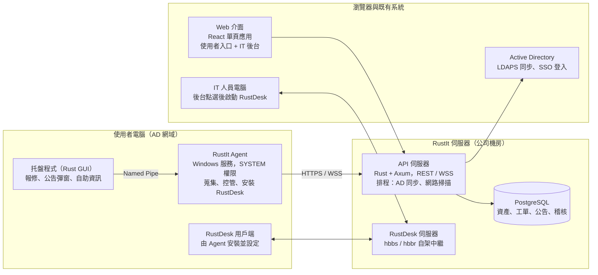
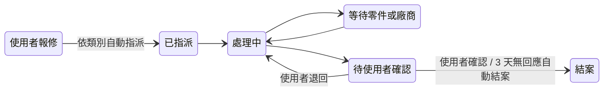
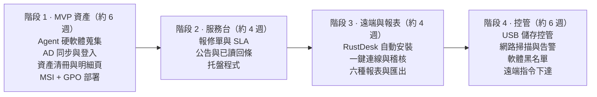

# 企業資產管理平台 PRD（RustIt）

2026-09-27

> 線上版（可留言協作）：https://claude.ai/code/artifact/4ae6c43f-d8a8-4911-9c1d-5d57710662c8

## 1. 產品概述

RustIt 是公司內部自建的 IT 資產管理與服務平台，對標 IP-guard、SmartIT，服務加入 AD 網域的 Windows 電腦與使用者。

**背景**：目前資產清冊靠人工盤點，報修走口頭或 Email，遠端協助需請使用者自行開啟工具，IT 難以掌握全公司軟硬體現況。

**目標**

1. 每台網域電腦自動回報軟硬體資料，資產清冊準確率達 95% 以上。
2. 使用者可線上報修，IT 可追蹤處理進度與 SLA。
3. IT 可從後台一鍵遠端連線任一在線電腦（RustDesk），不需使用者操作。
4. 提供硬體（USB）與網路存取的基本控管能力。

**非目標（第一版不做）**

- macOS / Linux 端點支援
- 螢幕錄影、鍵盤側錄、郵件內容稽核等深度 DLP 功能
- 取代 AD / GPO 的帳號與群組原則管理

**目標使用者**

| 角色 | 身分來源 | 主要用途 |
| --- | --- | --- |
| 一般使用者 | AD 網域帳號 | 報修、看公告、查自己的設備 |
| IT 管理員 | AD 群組 `IT-Admins` | 資產管理、處理工單、發公告、遠端協助、設定控管政策 |
| 主管 / 稽核 | AD 群組 `Asset-Viewers` | 唯讀檢視報表與資產清冊 |

## 2. 資料蒐集策略

建議以「端點 Agent 為主、AD 與網路掃描為輔」：Agent 拿得到最完整的資料，AD 補齊人與組織，網路掃描找出沒裝 Agent 的設備。

| 來源 | 方式 | 取得資料 | 頻率 |
| --- | --- | --- | --- |
| 端點 Agent（Rust，Windows Service） | WMI / CIM（`wmi` crate）、登錄檔、Win32 API、`sysinfo` | 硬體、軟體、網路、登入者、健康狀態 | 開機時完整回報；每 24 小時完整掃描；每 60 秒心跳 |
| Active Directory | 後端以 LDAPS 定時同步（`ldap3` crate） | 使用者、部門、OU、電腦帳號、最後登入時間 | 每 1 小時 |
| 網路掃描 | 後端或指定 Agent 對網段做 ARP / ICMP / SNMP 掃描 | 印表機、交換器、未安裝 Agent 的設備（IP、MAC、廠牌） | 每日 1 次 |
| 人工資料 | Web 後台輸入或 Excel 匯入 | 財產編號、採購日、保固到期、保管人 | 事件觸發 |

**Agent 蒐集項目**

- **硬體**：CPU、記憶體（各插槽）、硬碟（型號 / 序號 / 容量 / SMART）、主機板與 BIOS 序號、顯示卡、螢幕（EDID 序號）、網卡 MAC
- **軟體**：作業系統版本與 build、已安裝軟體（登錄檔 Uninstall 機碼）、Windows Update 狀態、防毒軟體狀態、Office 授權
- **網路**：IP、子網、閘道、DNS、連線中的 Wi-Fi SSID
- **使用者**：目前登入者、最近登入歷程、本機管理員群組成員
- **變更偵測**：每次完整掃描與上次比對，硬體拆換、軟體增刪產生變更紀錄與告警

**資產唯一識別**：以 BIOS 序號 + 主機板 UUID 為主鍵，電腦名稱或 IP 改變時不會變成新資產。

## 3. 系統架構建議

建議前後端分離：端點 Agent 與後端全部用 Rust，前端用 Web，全部部署在公司內部（地端），資料不出公司。



Agent 與托盤程式以 Named Pipe 溝通；Agent 以 HTTPS 回報資料，並維持一條 WebSocket 接收 IT 下達的指令。

| 元件 | 建議技術 | 理由 |
| --- | --- | --- |
| 端點 Agent | Rust：`windows-service`、`wmi`、`windows` crate、`tokio` | 單一 exe、記憶體佔用低（目標 < 30 MB）、不需安裝執行環境 |
| 托盤程式 | Rust：`tray-icon` + `egui`（或 Tauri） | 以登入使用者身分執行，負責需要畫面的功能 |
| 後端 API | Rust：`axum` + `sqlx` + `tokio`，JWT 驗證 | 與 Agent 共用資料結構（同一個 Cargo workspace） |
| 資料庫 | PostgreSQL 16 | JSONB 適合存彈性的硬體資料，報表查詢能力強 |
| 前端 | React + TypeScript + Ant Design | 表格、表單、圖表元件齊全，適合後台系統 |
| 遠端連線 | RustDesk Server OSS（hbbs / hbbr）自架 | 連線不經公共伺服器，可與後台整合 |
| 部署 | Docker Compose（API、DB、Web、RustDesk 伺服器） | 一台 Linux VM 即可跑起來 |

**建議的專案結構（Cargo workspace）**

```
RustIt/
├─ crates/
│  ├─ agent/        # Windows 服務
│  ├─ tray/         # 托盤程式
│  ├─ server/       # Axum API
│  └─ shared/       # 共用資料結構與通訊協定
├─ web/             # React 前端
└─ deploy/          # docker-compose、MSI 打包腳本
```

## 4. 功能需求：服務端（報修、公告、報表）

使用者從托盤程式或 Web 入口以 AD 帳號免密登入，報修時自動帶入電腦資產資料，IT 不必再問「你的電腦是哪台」。

### 4.1 報修單



等待零件期間暫停 SLA 計時；使用者退回會回到處理中並通知原處理人。

- 報修表單：類別（硬體 / 軟體 / 網路 / 帳號 / 其他）、緊急程度、描述、截圖（托盤程式一鍵截圖）
- 自動附帶：電腦名稱、IP、資產編號、登入者、最近一次資產快照
- IT 端：指派、轉單、內部備註、從工單直接發起 RustDesk 連線
- SLA：依緊急程度設定回應 / 解決時限，逾時通知主管
- 通知：托盤彈窗 + Email（SMTP），可選 Teams / LINE Webhook
- 滿意度：結案時 1–5 星評分

### 4.2 公告

- IT 在後台撰寫公告（純文字 + 圖片 + 連結）
- 發送對象：全公司、指定 AD OU、AD 群組、指定電腦
- 顯示方式：托盤氣泡通知、強制彈窗（需按「已閱讀」）、Web 公告欄
- 排程發送與到期下架
- 已讀回條：哪些人已讀、未讀，可對未讀者重發

### 4.3 報表

| 報表 | 內容 | 用途 |
| --- | --- | --- |
| 資產總表 | 依部門 / 廠區 / 型號統計電腦數量與規格 | 盤點、財務對帳 |
| 軟體授權報表 | 各軟體安裝數 vs 授權數、黑名單軟體 | 授權合規 |
| 硬體變更報表 | 期間內硬體拆換、新增、消失的設備 | 防止零件被換 |
| 汰換建議 | 使用年限、保固到期、低規格電腦清單 | 預算規劃 |
| 工單統計 | 每月件數、類別分布、平均處理時間、SLA 達成率 | IT 績效 |
| 安全狀態 | 未更新、無防毒、離線超過 30 天的電腦 | 資安稽核 |

所有報表可匯出 Excel / PDF，並可排程每月 Email 給主管。

## 5. 功能需求：資產與控管

資產資料由 Agent 自動維護，控管政策由 IT 在後台設定、以 AD OU / 群組為單位下達，Agent 在本機執行並回報違規事件。

### 5.1 資產調查與電腦資料蒐集

- 資產清冊：搜尋、篩選（部門、OU、型號、OS、在線狀態）、匯出
- 資產明細頁：硬體、軟體、網路、使用者、變更歷程、相關工單、遠端連線按鈕
- 財產資料：財產編號、採購日、金額、供應商、保固到期、保管人（手動或 Excel 匯入）
- 非電腦資產：印表機、螢幕、投影機、手機等手動登錄，可列印 QR Code 貼紙
- 盤點任務：IT 發起盤點，使用者在托盤確認「這台電腦 / 螢幕是我在使用」，或手機掃 QR Code 盤點
- 生命週期：入庫 → 領用 → 轉移 → 維修 → 報廢，每步留紀錄

### 5.2 硬體控管

| 功能 | 做法 | MVP |
| --- | --- | --- |
| USB 儲存裝置控管 | 封鎖 / 唯讀 / 允許；白名單以裝置序號指定。透過登錄檔 `USBSTOR` 與 SetupAPI 停用裝置 | 是 |
| 裝置插拔紀錄 | 監聽 WM_DEVICECHANGE，記錄插入的裝置與使用者 | 是 |
| 其他周邊 | 藍牙、光碟機、手機 MTP、印表機啟用 / 停用 | 否 |
| 硬體變更告警 | 記憶體、硬碟、顯示卡序號與上次不同即告警 | 是 |

### 5.3 網路控管

| 功能 | 做法 | MVP |
| --- | --- | --- |
| 未授權設備偵測 | 網路掃描發現的 MAC 不在資產清冊即告警 | 是 |
| 網站封鎖 | Agent 透過 Windows Filtering Platform（WFP）依網域黑名單封鎖 | 否 |
| 程式連線限制 | WFP 規則限制指定程式存取網路 | 否 |
| 流量統計 | 依程式統計上傳 / 下載流量 | 否 |
| 軟體黑名單 | 偵測到黑名單軟體（如 P2P）即告警，可選擇自動結束程序 | 是（告警） |

### 5.4 遠端管理指令

IT 可對單台或群組下達：立即重新掃描、重新開機、訊息彈窗、執行已簽章的 PowerShell 腳本、派送軟體。所有指令寫入稽核紀錄。

### 5.5 軟體派送（背景安裝 / 移除）

IT 勾選軟體後，由 Agent 以 SYSTEM 權限在背景靜默安裝或移除，使用者不需操作。設計細節見 [決策 0002](decisions/0002-software-deployment.md)。

- **軟體目錄**：名稱、版本、安裝檔、SHA-256、預期簽章者、靜默安裝 / 移除參數、「是否已安裝」判斷規則、是否需重開機、授權數量。支援 MSI、Inno Setup、NSIS、InstallShield、WiX Burn、Office 部署工具。
- **軟體組合**：多個軟體組成一組（例如「業務部標準組合」），可綁定 AD OU / 群組，新電腦加入即自動安裝，也可手動勾選。
- **安裝檔來源**：IT 事先下載、測試後放在內網 NAS，依「軟體\版本」分資料夾保存；由 RustIt 伺服器掛載 NAS（唯讀），經 nginx 以 HTTPS 提供給 Agent（mTLS 驗證、支援續傳、寫入稽核）。Agent 不直接連原廠網站，也不需要 NAS 帳密。多廠區可各放一台 NAS 作為分發點。
- **派送工作**：依序執行下載 → 驗證雜湊值與簽章 → 靜默安裝 → 重新掃描確認；後台即時顯示每台電腦、每個軟體的進度與結束代碼，失敗可重試。
- **移除**：使用登錄檔的解除安裝指令加上靜默參數，完成後輪詢登錄檔確認已移除。
- **限制**：同一台電腦一次只執行一個安裝；需重開機（結束代碼 3010）時不強制重開，改為通知使用者；分批派送並限速。
- **權限與稽核**：只有指定 AD 群組可派送；新增軟體到目錄建議兩人覆核；派送紀錄連動軟體授權報表（4.3），授權數用完不允許派送。

## 6. 功能需求：RustDesk 遠端協助

可行：Agent 以 SYSTEM 權限執行，能靜默安裝 RustDesk、寫入自架伺服器設定、設定密碼，再把 RustDesk ID 回報後台，IT 在資產頁按一下就能連線。

**Agent 自動化流程**

1. 檢查：讀登錄檔判斷 RustDesk 是否已安裝、版本是否符合後台指定版本。
2. 下載：從 RustIt 伺服器（不走外網）下載安裝檔，驗證 SHA-256。
3. 安裝：`msiexec /i rustdesk.msi /qn`，或 `rustdesk.exe --silent-install`。
4. 設定伺服器：`rustdesk.exe --config <匯出的設定字串>`，寫入自架 hbbs 位址與公鑰。
5. 設定密碼：`rustdesk.exe --password <隨機密碼>`，每台不同、加密後存在後台，可定期輪替。
6. 回報：`rustdesk.exe --get-id` 取得 ID，與資產綁定後回報。
7. 守護：每次完整掃描確認 RustDesk 服務在執行、設定未被竄改，否則自動修復。

**IT 端連線**

- 資產頁與工單頁提供「遠端連線」按鈕，啟動 IT 電腦上的 RustDesk 並帶入 ID 與密碼（`rustdesk://` 連結，實作時需實測參數格式）。
- 密碼不顯示在畫面上，只有 `IT-Admins` 群組可觸發。
- 每次連線寫入稽核紀錄：誰、何時、連到哪台、關聯哪張工單。

**使用者同意模式**（後台可依 OU 設定）

| 模式 | 行為 | 適用 |
| --- | --- | --- |
| 需使用者同意 | 連線時使用者電腦跳出確認框 | 一般辦公電腦（預設） |
| 免同意（無人值守） | 密碼正確即連線，畫面顯示「遠端連線中」 | 機台、共用電腦、下班後維護 |

## 7. 非功能需求

Agent 跑在每台電腦上且有 SYSTEM 權限，安全性與穩定性比功能多寡更重要。

| 面向 | 需求 |
| --- | --- |
| 驗證 | 使用者與 IT 以 AD 登入（LDAPS bind，後續可加 Kerberos / ADFS SSO）；權限依 AD 群組對應角色 |
| Agent 身分 | 首次註冊用一次性 enrollment token，之後以每台獨立的 client 憑證（mTLS）連線 |
| 傳輸 | 全程 TLS 1.2+；後端下達的腳本與安裝檔需簽章，Agent 驗簽後才執行 |
| 敏感資料 | RustDesk 密碼、AD 服務帳號密碼以 AES-256 加密儲存 |
| 稽核 | 登入、遠端連線、政策變更、指令下達全部留紀錄，保存 1 年 |
| Agent 資源 | 常駐記憶體 < 30 MB，平均 CPU < 1%，完整掃描時間 < 30 秒 |
| Agent 自我保護 | 一般使用者無法停止服務或解除安裝；離線時暫存資料，恢復連線後補傳 |
| 規模 | 單台伺服器（4 vCPU / 8 GB）支援 2,000 台端點 |
| 部署 | Agent 打包成 MSI，透過 AD GPO 軟體安裝派送；Agent 支援後台自動升級 |
| 相容性 | Windows 10 1809 以上、Windows 11、Windows Server 2016 以上，x64 |
| 隱私與合規 | 不蒐集檔案內容、螢幕畫面、鍵盤輸入；上線前以公司公告告知員工蒐集項目，符合個資法 |

## 8. 里程碑、風險與待決事項

建議先做資產蒐集：它是其他功能的基礎，也最快讓 IT 感受到價值。週數為一位工程師的粗估。



每個階段結束先在 IT 部門 10–20 台電腦試行，穩定後再擴大到全公司。

**風險**

- **防毒軟體誤判**：Agent 行為像監控軟體，可能被攔截。對策：程式碼簽章憑證、在防毒主控台加入白名單。
- **USB / 網路控管的技術難度**：深度控管需要核心驅動，第一版只用登錄檔與 WFP 使用者模式 API。
- **Agent 出錯影響全公司**：升級採分批發布（先 IT、再分部門），保留遠端停用開關。
- **RustDesk 命令列參數隨版本變動**：後台鎖定已驗證的 RustDesk 版本。

**待決事項**

- [ ] 公司約有多少台電腦、幾個廠區 / 網段？是否有離線或跨廠區 VPN 的電腦？
- [ ] 伺服器要用 Linux（Docker）還是 Windows Server？
- [ ] 前端要用 React 還是 Vue（團隊較熟悉哪個）？
- [ ] 是否已有程式碼簽章憑證？
- [ ] 遠端連線預設要「需使用者同意」還是「免同意」？
- [ ] 報修通知除 Email 外要串哪個通訊軟體（Teams / LINE）？
