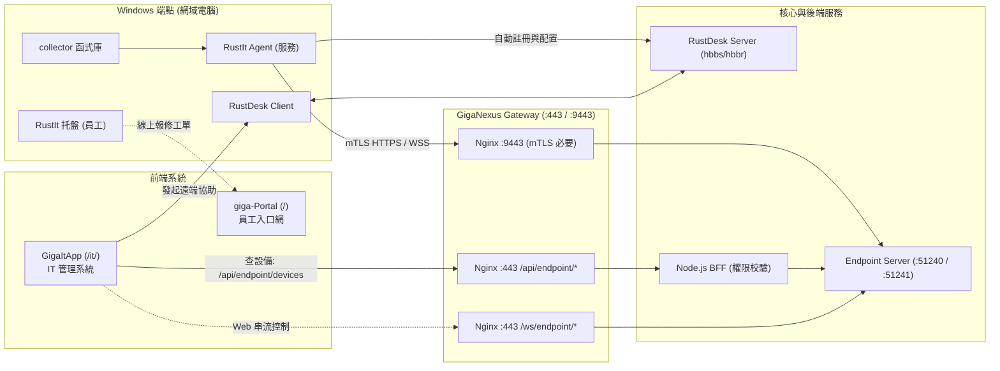

# 專案地圖 — RustIt (企業端點資產管理與控管平台)

> **最後更新**：2026-09-29  
> **目前階段**：階段 1 MVP·資產蒐集與效能評估驗證（`collector`、`demo` [Tauri]、`native` [egui] 已實作完成）。  
> **上位規範**：全專案總圖 [PROJECT-MAP.md](../../PROJECT-MAP.md)、Gateway 規範 [giga-api-gateway-bff/docs/](../../giga-api-gateway-bff/docs/)。

---

## 1. 目錄結構

```
RustIt/
├─ Cargo.toml                       Cargo Workspace 設定 (collector, demo, native)
├─ Cargo.lock
├─ README.md                        專案簡介與快速上手
├─ dist/                            編譯成品存放目錄 (RustIt-Demo.exe, RustIt-Native.exe)
├─ scripts/
│  └─ bench.ps1                     效能取樣腳本 (量測記憶體、CPU、行程與執行緒)
├─ docs/
│  ├─ PRD.md                        產品需求說明 (對標 IP-guard/SmartIT，四階段里程碑)
│  ├─ PROJECT-MAP.md                本文件 (專案結構、分層、流程、跨專案關係)
│  ├─ ui-performance-comparison.md  egui 原生 vs WebView2 效能實測比較報告
│  ├─ decisions/                    重大技術架構決策
│  │  └─ 0002-software-deployment.md 靜默軟體派送架構與安全機制
│  └─ images/                       架構與介面截圖
├─ crates/
│  ├─ collector/                    端點資料蒐集核心庫 (Library)
│  │  ├─ Cargo.toml                 相依：wmi, winreg, sysinfo, windows
│  │  └─ src/
│  │     ├─ lib.rs                  對外統一介面 (SystemInfo, collect() 進入點)
│  │     ├─ registry.rs             登錄檔掃描 (已安裝軟體 Uninstall 機碼、防毒狀態、USBSTOR)
│  │     └─ wmi_query.rs            WMI / CIM 查詢 (主機板 UUID、BIOS、CPU、磁碟 SMART、網卡)
│  ├─ demo/                         WebView2 概念驗證版 (Tauri / 輕量嵌入)
│  │  ├─ Cargo.toml
│  │  ├─ src/
│  │  │  ├─ main.rs                 Tauri 啟動、指令綁定 (蒐集、使用率、匯出 JSON)
│  │  │  └─ deploy.rs               軟體派送模擬與雜湊校驗
│  │  └─ ui/                        前端 HTML/CSS/JS (Liquid Glass 玻璃擬態)
│  │     ├─ index.html
│  │     ├─ css/ (style.css, tokens)
│  │     └─ js/ (app.js, devdata.js)
│  ├─ native/                       原生高效能 GUI 版 (egui 0.31)
│  │  ├─ Cargo.toml                 相依：eframe, egui, glow (OpenGL)
│  │  └─ src/
│  │     ├─ main.rs                 原生視窗進入點、eframe 迴圈、圖示與字型載入
│  │     ├─ app.rs                  主應用狀態機、畫面輪播、背景取樣排程
│  │     ├─ data.rs                 端點資料快取與背景執行緒橋接
│  │     ├─ theme.rs                玻璃質感配色、陰影、圓角與文字樣式
│  │     ├─ widgets.rs              自定義 Giga 風格元件 (玻璃卡片、計量表、狀態徽章)
│  │     ├─ pages.rs                各視圖 (總覽、硬體、網路、軟體、資安控管、遠端協助)
│  │     └─ perf.rs                 即時效能監控器 (每秒幀率、CPU 時間、記憶體工作集)
│  ├─ agent/ (規劃中)                常駐 Windows 服務 (SYSTEM 權限)
│  │  └─ 定時資料蒐集、USB 控管監聽、mTLS HTTPS 回報 + WebSocket 指令、RustDesk 守護
│  ├─ tray/ (規劃中)                 托盤程式 (一般使用者介面：報修、公告、設備自查)
│  └─ server/ (規劃中)               Endpoint Server (Axum，HTTPS / WebSocket，接收 Agent 回報)
```

---

## 2. 系統分層架構

| 層次 | 所屬元件 | 責任與主要功能 |
| :--- | :--- | :--- |
| **資料蒐集層 (Collector)** | `crates/collector` | 呼叫 Win32 API、WMI (`root\cimv2`) 與 Registry，產出結構化資產物件 (`SystemInfo`)。不依賴任何 UI。 |
| **端點展現層 (Presentation)** | `crates/native` (egui)<br/>`crates/demo` (WebView2)<br/>`crates/tray` (托盤) | • `native`：極低記憶體 (<90MB)、超快啟動的原生介面，供工程師快速檢測。<br/>• `demo`：驗證複雜動畫與 Web 玻璃擬態體驗。<br/>• `tray`：常駐工作列，提供員工自助報修與重要公告。 |
| **端點後台服務 (Service)** | `crates/agent` (規劃) | 註冊為 Windows Service，具備 LocalSystem 權限，負責 USBSTOR 封鎖、軟體背景安裝、RustDesk 守護。 |
| **通訊與傳輸層 (Transport)** | `agent` ➔ Gateway | 以 X.509 裝置憑證透過 Gateway `:9443` (mTLS) 以 HTTPS 回報資產、維持一條 WebSocket 接收指令與心跳（2026-10-01 決定，不用 gRPC；ADR 0001）。 |

---

## 3. 與 GigaNexus 其他專案的對應關係



1. **對應 `giga-api-gateway-bff`**：
   - Agent 走 Gateway 專用端口 `:9443`，透過 mTLS 認證裝置身分，與 `Endpoint Server` 長連線。
   - 瀏覽器管理請求走 Gateway `:443` 的 `/api/endpoint/*`，經由 BFF 驗證 `endpoint.device.read` 後轉發。
   - **後期待辦（Agent 上線前，W6）**：Gateway 端 `:9443` 目前仍是 gRPC 版，需改寫為 HTTPS / WebSocket，與本專案 W6-1 訊息協定一起進行：
     - `../giga-api-gateway-bff/nginx/conf.d/agent.conf`：`grpc_pass` 改為 `proxy_pass https://` + WebSocket 升級；環境變數 `ENDPOINT_GRPC_UPSTREAM` 改名 `ENDPOINT_AGENT_UPSTREAM`。
     - Gateway E2E `bff/test/e2e/06-websocket-agent.test.ts` 與模擬服務 `tools/mock-upstream/endpoint.js` 改為 HTTPS / WebSocket。
     - CRL 定期更新、200 條 WebSocket 壓測。
     - 規格與清單見 `../giga-api-gateway-bff/docs/ENDPOINT-AGENT-GUIDE.md` §4、§10（G0、G1、G3）、§11。
2. **對應 `GigaItApp`**：
   - `GigaItApp` 的「端點管理 ➔ 電腦清單」頁面直接呈現 `RustIt` 回報的硬體、軟體與資安狀態。
   - IT 在 `GigaItApp` 點擊連線時，可自動帶入 `RustIt` 管理之電腦的 RustDesk 授權 ID 與密碼連線。
3. **對應 `giga-Portal`**：
   - 使用者透過 `RustIt Tray` 進行問題報修時，自動綁定資產唯一 ID（BIOS + 主機板 UUID），直接連動到 `giga-Portal` 待辦與服務中心。

---

## 4. 要改什麼 → 看哪裡

| 開發任務 | 主要修改目錄與檔案 | 備註 |
| :--- | :--- | :--- |
| **新增硬體/軟體蒐集項目** | `crates/collector/src/wmi_query.rs`、`registry.rs`、`lib.rs` | 擴充結構體欄位，注意相容 Windows 10/11 |
| **調整 egui 原生介面版面** | `crates/native/src/pages.rs` | 調整各分頁 layout、文字與圖表排版 |
| **微調原生版玻璃擬態與色彩** | `crates/native/src/theme.rs`、`widgets.rs` | 調整透明度、邊框、高光與陰影數值 |
| **調整 WebView2 Demo 介面** | `crates/demo/ui/` (`index.html`, `style.css`, `app.js`) | 免編譯，可用 `python -m http.server` 即時預覽 |
| **軟體靜默派送規則** | `crates/demo/src/deploy.rs`，參照 [0002 號架構決策](decisions/0002-software-deployment.md) | 支援 MSI, Inno Setup, NSIS 等靜默參數 |
| **效能評估取樣** | `scripts/bench.ps1` | `powershell -File scripts/bench.ps1 -Runs 3` |

---

## 5. 測試與效能驗證

- **單元測試與純資料測試**：
  ```bash
  cargo test -p rustit-collector
  cargo run -p rustit-collector --example dump
  ```
- **執行測試**：
  ```bash
  cargo run -p rustit-native    # 原生 egui 高效能版
  cargo run -p rustit-demo      # WebView2 完整特效版
  ```
- **效能並排量測 (Benchmark)**：
  ```bash
  cargo build --release -p rustit-native -p rustit-demo
  powershell -ExecutionPolicy Bypass -File scripts/bench.ps1 -Runs 3
  ```
