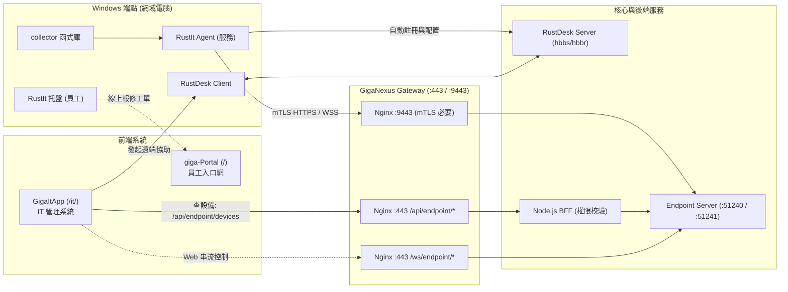

# 專案地圖 — RustIt (企業端點資產管理與控管平台)

> **最後更新**：2026-10-06(M0 目錄拆分與資料契約;M1 ItAgentBack;M2 rustit-agent)  
> **目前階段**：階段 1 MVP·資產蒐集與效能評估驗證（`collector`、`demo` [Tauri]、`native` [egui] 已實作完成）。  
> **上位規範**：全專案總圖 [PROJECT-MAP.md](../../PROJECT-MAP.md)、Gateway 規範 [giga-api-gateway-bff/docs/](../../giga-api-gateway-bff/docs/)。

---

## 1. 目錄結構

```
RustIt/
├─ README.md                        專案簡介與快速上手
├─ AGENT.md                         AI 協作準則(分工、部署區、Rust / Node.js 規則、修正紀錄)
├─ docs/                            兩個子專案共用的文件(Gateway 等其他專案以 ../RustIt/docs/... 參照,不搬動)
│  ├─ PRD.md                        產品需求說明 (對標 IP-guard/SmartIT，四階段里程碑)
│  ├─ INTEGRATION-PLAN.md           整合計畫:Agent → Node.js Endpoint Server → GigaItApp 電腦清單(目標、階段、待決)
│  ├─ HANDOFF.md                    交接:目前進度、已決定事項、需先同意的跨 repo 動作
│  ├─ contracts/                    Agent ↔ Server 資料契約(JSON Schema + 去識別化範例;兩端契約測試共用)
│  │  ├─ inventory.schema.json      POST /agent/v1/inventory
│  │  ├─ sync.schema.json           POST /agent/v1/sync(請求與回應,M5)
│  │  ├─ ws-envelope.schema.json    WebSocket 信封與 hello / heartbeat / heartbeat_ack
│  │  └─ examples/                  去識別化範例(假的使用者、序號、MAC、IP)
│  ├─ DevelopmentProcess/           修正紀錄(NewFeatures.md 等)
│  ├─ PROJECT-MAP.md                本文件 (專案結構、分層、流程、跨專案關係)
│  └─ decisions/                    重大技術架構決策
│     ├─ 0001-nginx-gateway-and-grpc.md Nginx 與通訊(Agent 改 HTTPS + WebSocket)
│     ├─ 0002-software-deployment.md 靜默軟體派送架構與安全機制
│     ├─ 0003-code-signing-pki.md   程式碼簽章與 PKI
│     └─ 0004-node-endpoint-server.md Endpoint Server 改用 Node.js(Rust 只做端點)
├─ RustAgent/                       Rust:端點電腦上的程式(Cargo workspace)
│  ├─ Cargo.toml                    Workspace 設定 (collector, demo, native)
│  ├─ Cargo.lock
│  ├─ dist/                         編譯成品存放目錄 (RustIt-Demo.exe, RustIt-Native.exe,不進版控)
│  ├─ scripts/
│  │  └─ bench.ps1                  效能取樣腳本 (量測記憶體、CPU、行程與執行緒)
│  ├─ docs/
│  │  ├─ ui-performance-comparison.md egui 原生 vs WebView2 效能實測比較報告
│  │  └─ images/                    介面截圖
│  └─ crates/
│     ├─ collector/                 端點資料蒐集核心庫 (Library)
│     │  ├─ Cargo.toml              相依：wmi, winreg, sysinfo
│     │  └─ src/
│     │     ├─ lib.rs               對外統一介面 (ComputerInfo, collect() 進入點)
│     │     ├─ registry.rs          登錄檔掃描 (已安裝軟體 Uninstall 機碼、USBSTOR、RustDesk)
│     │     └─ wmi_query.rs         WMI / CIM 查詢 (主機板 UUID、BIOS、CPU、磁碟、網卡、防毒)
│     ├─ demo/                      WebView2 概念驗證版 (Tauri)
│     │  ├─ src/ main.rs、deploy.rs Tauri 啟動與指令綁定;軟體派送模擬與雜湊校驗
│     │  └─ ui/                     前端 HTML/CSS/JS (Liquid Glass 玻璃擬態)
│     ├─ native/                    原生高效能 GUI 版 (egui;main / app / data / theme / widgets / pages / perf)
│     ├─ agent/                     端點 Agent(rustit-agent run --config agent.toml;前景執行,服務化屬後續)
│     │  ├─ agent.dev.toml / agent.example.toml  本機直連 ItAgentBack / 測試區經 :9443 的設定範本
│     │  ├─ src/main.rs             只組裝:參數、日誌、Ctrl+C
│     │  ├─ src/lib.rs              啟動隨機延遲 → 資產回報與 WebSocket 兩個工作
│     │  ├─ src/config.rs           agent.toml 解析與檢查(http 只允許本機、dev 模擬憑證標頭)
│     │  ├─ src/tls.rs              rustls ClientConfig(ring)、憑證來源 trait CertSource(本階段 PEM 檔)
│     │  ├─ src/transport.rs        HTTPS 回報與 WebSocket 連線,錯誤分類(被拒 10 分鐘 / 其他指數退避)
│     │  ├─ src/inventory.rs        蒐集 → POST /agent/v1/inventory 迴圈
│     │  ├─ src/ws.rs               hello / 30 秒 heartbeat / unsupported、斷線重連
│     │  ├─ src/protocol.rs         契約型別、content_hash
│     │  ├─ src/backoff.rs          1 秒起、上限 2 分鐘、±20%;啟動延遲
│     │  └─ tests/contract.rs       以 docs/contracts 的 JSON Schema 驗證送出的 JSON
│     └─ tray/ (規劃中)              托盤程式 (一般使用者介面：報修、公告、設備自查)
└─ ItAgentBack/                     Node.js(Fastify + TypeScript):Endpoint Server(ADR 0004);gateway.project = RustIt
   ├─ src/server.ts                 啟動兩個 listener:51240 管理 API、51241 Agent 通道
   ├─ src/config.ts                 部署區設定;dev 旁路(非 dev 設定即失敗)、test / prod 機密只收 _FILE
   ├─ src/mgmt-app.ts               :51240 X-Internal-Token、OpenAPI(x-permission)、setupGateway 監控與自動註冊
   ├─ src/agent-app.ts              :51241 裝置身分 hook(x-client-cert-*、信任來源)、/agent/v1/inventory、/agent/v1/ws
   ├─ src/routes/devices.ts         GET /v1/devices、/v1/devices/{deviceId}(endpoint.device.read)
   ├─ src/services/device-service.ts 寫入順序、hash 比對、降級、在線狀態(唯一的業務邏輯層)
   ├─ src/stores/                   types.ts 介面;sql-store(mssql)、mongo-store、redis-store
   ├─ src/contracts.ts              讀 ../docs/contracts(不複製)、型別
   ├─ src/db/migrator.ts、migrate.ts 手寫 SQL migration 與整合測試庫重建
   ├─ db/dba/                       建庫 T-SQL(DBA 以 sa 執行,AI 不執行)
   ├─ db/migrations/                0001_init.sql:ita.device、device_inventory、device_nic、device_event
   ├─ deploy/docker-compose.dev.yml 本機 Mongo 7 / Redis 7(只綁 127.0.0.1)
   ├─ test/                         單元與契約測試(記憶體儲存);test/int/ 整合測試(真實三種儲存)
   └─ docs/DB_SCHEMA.md             資料結構與寫入順序
```

---

## 2. 系統分層架構

| 層次 | 所屬元件 | 責任與主要功能 |
| :--- | :--- | :--- |
| **資料蒐集層 (Collector)** | `RustAgent/crates/collector` | 呼叫 Win32 API、WMI (`root\cimv2`) 與 Registry，產出結構化資產物件 (`SystemInfo`)。不依賴任何 UI。 |
| **端點展現層 (Presentation)** | `RustAgent/crates/native` (egui)<br/>`RustAgent/crates/demo` (WebView2)<br/>`RustAgent/crates/tray` (托盤) | • `native`：極低記憶體 (<90MB)、超快啟動的原生介面，供工程師快速檢測。<br/>• `demo`：驗證複雜動畫與 Web 玻璃擬態體驗。<br/>• `tray`：常駐工作列，提供員工自助報修與重要公告。 |
| **端點後台服務 (Service)** | `RustAgent/crates/agent`(M2:前景執行,服務化規劃中) | 註冊為 Windows Service，具備 LocalSystem 權限，負責 USBSTOR 封鎖、軟體背景安裝、RustDesk 守護。 |
| **通訊與傳輸層 (Transport)** | `agent` ➔ Gateway | 以 X.509 裝置憑證透過 Gateway `:9443` (mTLS) 以 HTTPS 回報資產、維持一條 WebSocket 接收指令與心跳（2026-10-01 決定，不用 gRPC；ADR 0001）。 |

---

## 3. 與 GigaNexus 其他專案的對應關係



1. **對應 `giga-api-gateway-bff`**：
   - Agent 走 Gateway 專用端口 `:9443`，透過 mTLS 認證裝置身分，與 `Endpoint Server` 長連線。
   - 瀏覽器管理請求走 Gateway `:443` 的 `/api/endpoint/*`，經由 BFF 驗證 `endpoint.device.read` 後轉發。
   - **後期待辦（Agent 上線前，W6）**：Gateway 端 `:9443` 目前仍是 gRPC 版，需改寫為 HTTPS / WebSocket，與本專案 W6-1 訊息協定一起進行：
     - `../giga-api-gateway-bff/nginx/conf.d/agent.conf`：`grpc_pass` 改為 `proxy_pass https://` + WebSocket 升級；環境變數 `ENDPOINT_GRPC_UPSTREAM` 改名 `ENDPOINT_AGENT_UPSTREAM`。
     - Gateway E2E `bff/test/e2e/06-websocket-agent.test.ts` 與模擬服務 `tools/mock-upstream/endpoint.js` 改為 HTTPS / WebSocket。
     - CRL 定期更新、200 條 WebSocket 壓測。
     - 規格與清單見 `../giga-api-gateway-bff/docs/ENDPOINT-AGENT-GUIDE.md` §4、§10（G0、G1、G3）、§11。
2. **對應 `GigaItApp`**：
   - `GigaItApp` 的「端點管理 ➔ 電腦清單」頁面直接呈現 `RustIt` 回報的硬體、軟體與資安狀態。
   - IT 在 `GigaItApp` 點擊連線時，可自動帶入 `RustIt` 管理之電腦的 RustDesk 授權 ID 與密碼連線。
3. **對應 `giga-Portal`**：
   - 使用者透過 `RustIt Tray` 進行問題報修時，自動綁定資產唯一 ID（BIOS + 主機板 UUID），直接連動到 `giga-Portal` 待辦與服務中心。

---

## 4. 要改什麼 → 看哪裡

| 開發任務 | 主要修改目錄與檔案 | 備註 |
| :--- | :--- | :--- |
| **新增硬體/軟體蒐集項目** | `RustAgent/crates/collector/src/wmi_query.rs`、`registry.rs`、`lib.rs` | 擴充結構體欄位，注意相容 Windows 10/11 |
| **調整 egui 原生介面版面** | `RustAgent/crates/native/src/pages.rs` | 調整各分頁 layout、文字與圖表排版 |
| **微調原生版玻璃擬態與色彩** | `RustAgent/crates/native/src/theme.rs`、`widgets.rs` | 調整透明度、邊框、高光與陰影數值 |
| **調整 WebView2 Demo 介面** | `RustAgent/crates/demo/ui/` (`index.html`, `style.css`, `app.js`) | 免編譯，可用 `python -m http.server` 即時預覽 |
| **軟體靜默派送規則** | `RustAgent/crates/demo/src/deploy.rs`，參照 [0002 號架構決策](decisions/0002-software-deployment.md) | 支援 MSI, Inno Setup, NSIS 等靜默參數 |
| **效能評估取樣** | `RustAgent/scripts/bench.ps1` | `powershell -File scripts/bench.ps1 -Runs 3` |
| **改 Agent ↔ Server 訊息格式** | `docs/contracts/`(schema + 範例)→ `RustAgent/crates/agent/src/protocol.rs` → `ItAgentBack/src/contracts.ts` | 只新增欄位;兩端契約測試一起更新(AGENT.md §7.3) |
| **改回報寫入順序、降級、在線判斷** | `ItAgentBack/src/services/device-service.ts` | 路由與 store 不放業務邏輯 |
| **改資料表** | 新增 `ItAgentBack/db/migrations/000N_*.sql`(SQL Server 2012 語法)、`ItAgentBack/docs/DB_SCHEMA.md` | 已套用的 migration 不可修改 |
| **新增管理 API** | `ItAgentBack/src/routes/`、`src/openapi.ts`(`x-permission`、`x-gherkin`) | 需配合 GigaItApp `gateway-rbac.yaml` 的 `includes` |
| **改 Agent 連線、心跳、重試** | `RustAgent/crates/agent/src/ws.rs`、`transport.rs`、`backoff.rs` | 規範 ENDPOINT-AGENT-GUIDE §4.2、§6 |

---

## 5. 測試與效能驗證

- **單元測試與純資料測試**：
  ```bash
  cd RustAgent
  cargo test -p rustit-collector
  cargo run -p rustit-collector --example dump
  ```
- **執行測試**：
  ```bash
  cd RustAgent
  cargo run -p rustit-native    # 原生 egui 高效能版
  cargo run -p rustit-demo      # WebView2 完整特效版
  ```
- **效能並排量測 (Benchmark)**：
  ```bash
  cd RustAgent
  cargo build --release -p rustit-native -p rustit-demo
  powershell -ExecutionPolicy Bypass -File scripts/bench.ps1 -Runs 3
  ```
